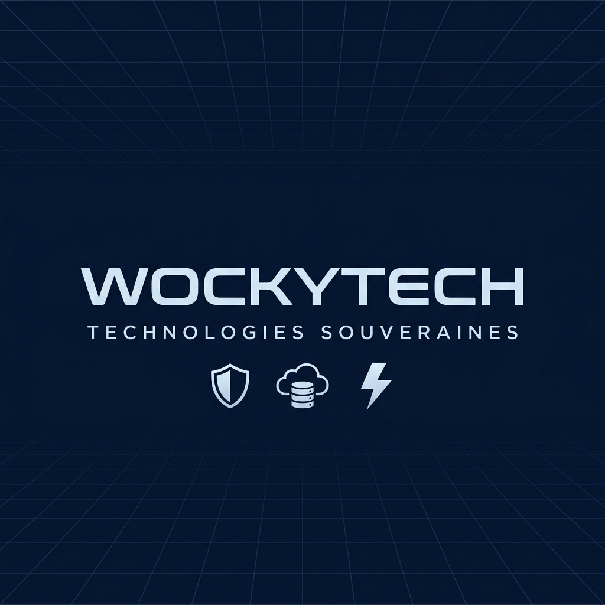

# 🛡️ WockyTech | Technologies Souveraines

Bienvenue sur le dépôt officiel du portfolio de **WockyTech**, conçu et développé par **Amadou Mactar Ndiaye**. 

Ce projet est une vitrine technologique axée sur la souveraineté numérique, la sécurité et l'architecture logicielle critique. Il présente des solutions robustes pour l'administration moderne et l'industrie B2B.



## 🚀 Vision Opérationnelle

WockyTech incarne l'indépendance numérique à travers des architectures isolées, hautement sécurisées et optimisées pour la performance nationale.

## 🛠️ Unités Opérationnelles (Projets)

### [SGOP Portail](https://wockytech.xyz)
Infrastructure critique pour la Police Nationale. Centralisation des flux et monitoring temps réel.
- **Stack** : Next.js 15, MySQL Core, AES-256 / MFA, Vercel Edge.

### [Lumoroptic](https://wockytech.xyz)
Plateforme SaaS d'optimisation logistique pour l'industrie optique. Automatisation B2B et gestion de stocks matriciels complexes.
- **Stack** : Next.js, Tailwind CSS, Matrice SPH/CYL.

### [Nostopp](https://wockytech.xyz)
Infrastructure e-commerce 'from scratch' pour le luxe. Contrôle total sur l'expérience client et les données.
- **Stack** : Next.js, TypeScript, Sync WhatsApp, MySQL.

## 🧠 Arsenal Technique

- **Architecture** : Next.js / TypeScript / React
- **Backend & Sécurité** : Java Spring Boot / Spring Security / JWT
- **Data** : MySQL / PostgreSQL / Redis
- **Mobile** : Flutter / React Native
- **DevOps** : Vercel / CI/CD GitHub Actions

## 🏗️ Installation & Développement

Ce projet utilise **Next.js 15** avec l'App Router.

```bash
# Installation des dépendances
npm install

# Lancement du serveur de développement
npm run dev
```

## 🔐 Sécurité & Intégrité

Le système inclut un **Splash Screen d'authentification simulé** et des protocoles de navigation sécurisés pour refléter les standards de production des applications critiques.

---
© 2026 **WockyTech** • Technologies Souveraines. Tous les systèmes sont opérationnels.
